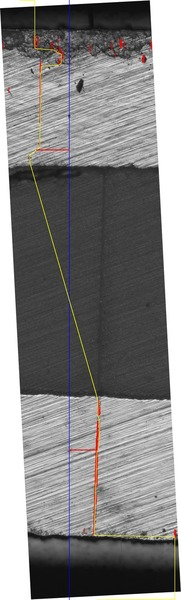
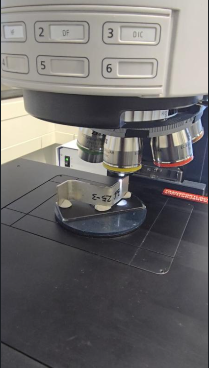
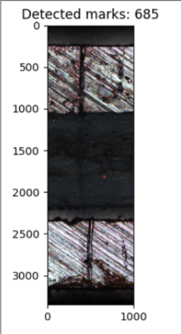
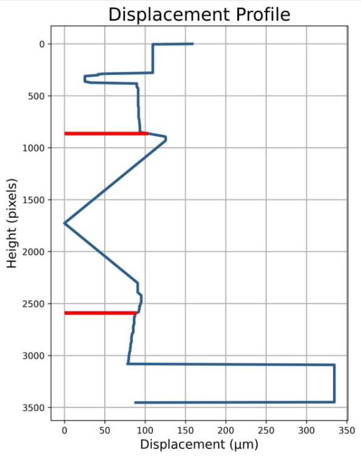
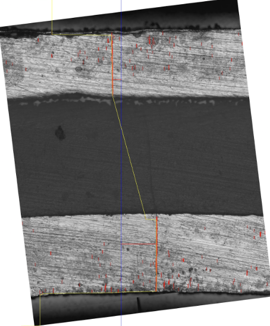
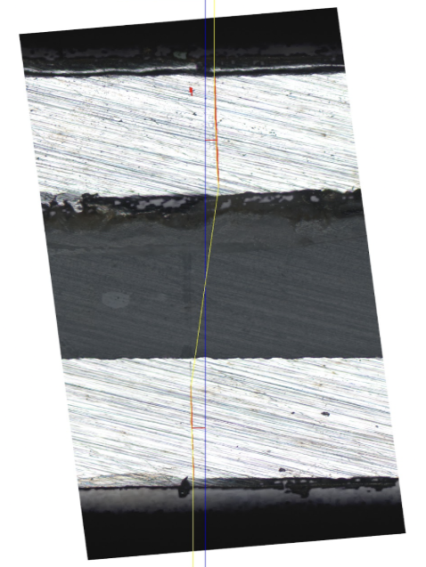

# Micro-Scale Displacement Measurement with Computer Vision

**Python and OpenCV tool that measures micrometer-scale layer displacement in bent sandwich sheets from microscope images, and writes overlay images, displacement graphs and CSV results automatically.**


*Crack pixels in red, median reference line in blue, tracked crack path in yellow.*

| | |
|---|---|
| **Course** | Intelligent Forming Systems, IMET Umformtechnik metallischer Werkstoffe und Verbunde, TU Clausthal |
| **Period** | Oct 2025 - Feb 2026 |
| **Team** | 5 students with fixed roles |
| **My role** | Project manager: planned and coordinated the work from image acquisition to the final presentation |

| Team member | Role |
|---|---|
| Nikhil Vinayagamurthy | Project manager |
| Raghav Dixit | Experimentalist |
| Kevin Kurisinkal Reji | Programmer |
| Mudabbir Ahmed Khan | Data analyst |
| Jashanjot Singh | Documentation lead |

---

## Problem

Lightweight hybrid sandwich sheets are used in automotive and aerospace parts. When they are bent, their layers shift against each other in the plane by a few micrometers. Conventional contact methods cannot measure this reliably, so the task was a non-contact optical tool that measures it automatically.

## Data acquisition

- **3 different sandwich sheet specimens** were imaged under controlled conditions with laboratory microscope imaging.
- Physical reference marks were applied along the specimen edges.
- In total, **14 samples** were evaluated.



## Method

### Approach 1: blob detection, discarded
The first algorithm detected the reference marks as blobs and measured their shift. Scratches and oxidation on the surface were detected as marks too: **685 detections instead of the 2 real marks**. The method was not reliable on real specimens.



### Approach 2: morphology-based crack tracking, final
Instead of single points, the tool follows the continuous crack line at the layer interface and measures its perpendicular distance from a static reference line. Following a line makes the result robust against scratches and oxidation.

| Step | Operation | Purpose |
|---|---|---|
| 1 | Grayscale and 5x5 Gaussian blur | Remove color and noise |
| 2 | Black-hat morphology, 21x21 kernel | Enhance dark crack regions |
| 3 | Otsu threshold and 3x3 opening | Binary mask without small noise |
| 4 | Vertical structuring element, 3x35 | Keep only vertical crack structures |
| 5 | Region mask on top and bottom thirds | Limit detection to the silver interface layers |
| 6 | Row-by-row tracking with interpolation and a 9-point moving average | One continuous, smooth crack path, without jumping between cracks |
| 7 | Deviation from the median reference line at 1/4 and 3/4 height | Top, bottom and total displacement |
| 8 | Pixel to micrometer conversion with a calibration factor | Physical units |

## Results

For every image the tool saves, with no manual post-processing:
- an **overlay image** with crack pixels, reference line and tracked path
- a **displacement graph** over the specimen height
- a **CSV file** with top, bottom and total displacement in px, µm and mm

Example results, Part 1:

| Sample | Top in µm | Bottom in µm | Total in µm |
|---|---|---|---|
| 1 | 103.69 | 89.20 | 192.88 |
| 2 | 129.30 | 91.88 | 221.18 |
| 3 | 71.53 | 73.18 | 144.70 |
| 4 | 81.80 | 36.86 | 118.66 |
| 5 | 69.94 | 17.06 | 86.99 |

All results: [CV3_results.csv](CV3_results.csv)


*Displacement profile of Part 1, Mark 2. The red lines mark the measured top and bottom displacement.*

| Part 2 | Part 3 |
|---|---|
|  |  |

### Next steps
- Compare the results against an independent reference measurement.
- Refine crack edge detection beyond whole-pixel resolution.

## How to run

```bash
git clone https://github.com/Nikhilvinayagamurthy/Measurement-of-Micro-Scale-Displacement-Using-Computer-Vision.git
cd Measurement-of-Micro-Scale-Displacement-Using-Computer-Vision
pip install opencv-python numpy pandas matplotlib
```

Open `src/measure_displacement.py`, set `IMG_PATH` to your image and `PIXEL_TO_MICRON` to your calibration factor, then run:

```bash
python src/measure_displacement.py
```

The overlay image, graph and CSV file are saved to the output folder defined in the script.

## Tools
Python, OpenCV, NumPy, Pandas, Matplotlib

---
Technische Universität Clausthal | MSc Intelligent Manufacturing
